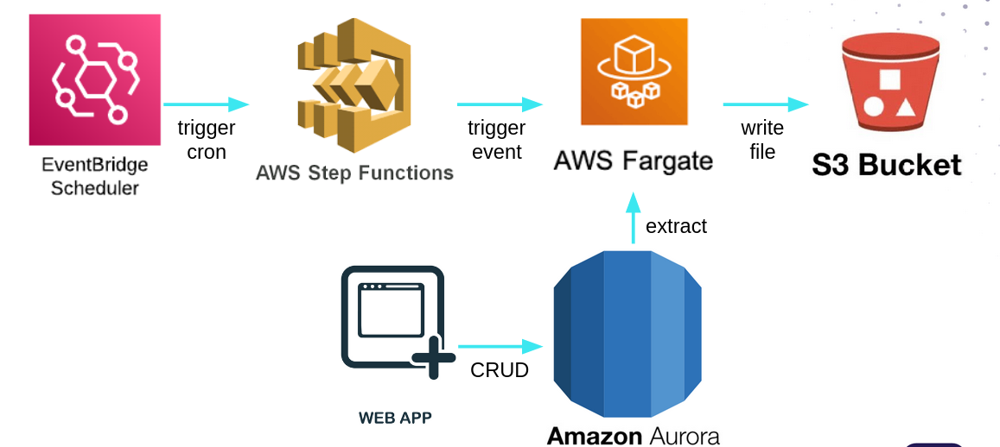
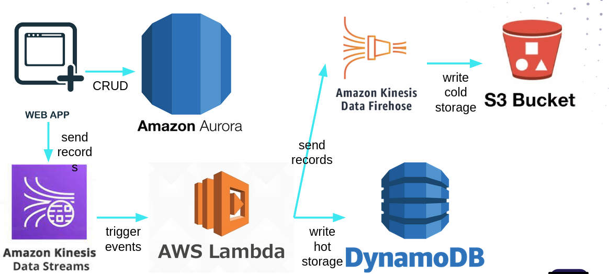

# Démo ingestion batch et streaming sur AWS

Pour vous aider vous pouvez voir [la vidéo de la démo live](https://www.youtube.com/live/aLUGiSkocME?si=wXzlqE-g3hg7zHFP).

## Prérequis

Avoir d'installé :
* awscli, la version 2
* sam (Serverless Application Model) version 1.x
* Docker version >= 25.0.3
* Poetry version 1.17.1
* sbt version 1.9.9
* Java version 17 ou 21
* Avoir un terminal authentifié à son compte AWS 

## Archi

Batch :



Streaming :



## Déployer l'infra de base

Dans l'infra de base on va trouver une aurora DB qui contiendra de la donnée fake et un bucket S3 qui sera notre datalake.

Depuis la racine du repo, lancez ces commandes. L'option `--guided` sera utile la première fois pour configurer le déploiement.

```bash
sam build
sam deploy [--guided]
```

Des outputs sont aussi créées pour pouvoir faire référence au bucket S3 et à l'aurora DB dans d'autres stacks cloud formation.

## Batch

Toutes les commandes sont à faire dans le dossier `batch` :

```bash
cd batch
```

### Tests

Il n'y a pas de tests dans ce projet

### Build

Pour construire un jar :

```bash
sbt assembly
```

Pour construire une image de conteneur :

```bash
docker build -t <image_name> .
```

### Deploy

1. déployer l'infra

La première fois on peut utiliser `--guided` pour configurer son déploiement. Il faut notamment penser à donner les valeurs des subnets. Pour cela utilisez le même format fourni en valeur par défaut.
```bash
sam build
sam deploy [--guided]
```

2. Récupérer le URI du ECR et déployer notre image de conteneur

Il sera d'abord nécessaire de récupérer les credentials pour l'ECR avec la commande docker login :
```bash
aws ecr get-login-password --region eu-west-1 | docker login --username AWS --password-stdin <account_id>.dkr.ecr.eu-west-1.amazonaws.com
```

```bash
docker build -t <URI_ECR> .
docker push <URI_ECR>
```

### Insérer de la donnée fake dans notre base de donnée

Pour le moment notre base de donnée de contient aucune données. Lancer l'ingestion ne fonctionnera donc pas car la table recherchée n'existe pas.

Pour insérer de la donnée il existe dans le projet batch un fichier `CreateData.scala`. Dans ce fichier on trouve un main qui insèrera 10 batchs de 10 000 lignes, soit 1 000 000 de lignes dans notre base de données.

Pour le lancer plusieurs choix s'offrent à vous :
* Depuis votre poste local, il faudra bien définir toutes les variables d'environnement présent dans le code. Ces valeurs sont récupérable dans la console AWS dans Cloud Formation.
* Le déployer dans un nouveau fargate et le déclencher à la main. Pour ça on pourra s'inspirer du fargate d'ingestion.
* Utiliser le fargate actuel de l'ingestion et juste changer la class main configurée dans sbt puis redéployer. Toutes les variables d'environnement y sont déjà configurées.

## Streaming

Dans ce projet vous trouverez un producer de données à déployer pour simuler des événements ainsi qu'un consumer de donnée.

Toutes les commandes sont à faire dans le dossier `streaming` :

```bash
cd streaming
```

### Tests

Il n'y a pas de tests dans ce projet

### Build

Pour le producer de donnée nous déploierons un conteneur :

```bash
docker build -t <image_name> .
```

### Deploy

1. déployer l'infra

La première fois on peut utiliser `--guided` pour configurer son déploiement. Il faut notamment penser à donner les valeurs des subnets. Pour cela utilisez le même format fourni en valeur par défaut.
```bash
sam build
sam deploy [--guided]
```

**ATTENTION** : la commande `sam deploy` ne s'arrêtera pas car le service fargate déployé pour le producer de donnée ne trouvera pas son image de conteneur. Mais pendant que celui-ci attend de trouver son image, vous pouvez passer à l'étape suivante dans un nouveau terminal. 

2. Récupérer le URI du ECR et déployer notre image de conteneur

Il sera d'abord nécessaire de récupérer les credentials pour l'ECR avec la commande docker login :
```bash
aws ecr get-login-password --region eu-west-1 | docker login --username AWS --password-stdin <account_id>.dkr.ecr.eu-west-1.amazonaws.com
```

```bash
docker build -t <URI_ECR> .
docker push <URI_ECR>
```
